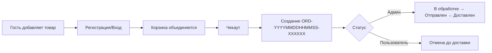

# 🎧 KENZOSTORE — современный e-commerce на Flask

<div align="center">

[](https://www.python.org/)
[](https://flask.palletsprojects.com/)
[](https://getbootstrap.com/)
[](LICENSE)

**Интернет-магазин электроники с личным кабинетом, корзиной, отслеживанием заказов и визуальной админкой.**

</div>

---

## 📌 Содержание
- [Почему KENZOSTORE](#почему-kenzostore)
- [Функциональные блоки](#функциональные-блоки)
- [Технологии](#технологии)
- [Скриншоты и демо](#скриншоты-и-демо)
- [Структура проекта](#структура-проекта)
- [Быстрый старт](#быстрый-старт)
- [Работа с данными](#работа-с-данными)
- [Жизненный цикл заказа](#жизненный-цикл-заказа)
- [API и маршруты](#api-и-маршруты)
- [Продакшн-чеклист](#продакшн-чеклист)
- [FAQ](#faq)
- [Лицензия](#📄-лицензия)

---

## Почему KENZOSTORE

- **Живой каталог**: категории с эмодзи, описаниями и карточками товаров.
- **Продуманная UX-воронка**: от анонимного просмотра к авторизованным заказам.
- **Zero-DB setup**: JSON-хранилище → проект запускается без отдельной БД.
- **Админ-панель “из коробки”**: CRUD для товаров, загрузка/очистка изображений, управление характеристиками.
- **Онлайн-отслеживание заказов**: статусы, история заказов, отмена пользователем, глобальное управление.

---

## Функциональные блоки

### 🛍 Для покупателей
- Каталог с быстрым добавлением в корзину (AJAX).
- Регистрация/вход, объединение корзин гостя и аккаунта.
- Корзина с изменением количества, очисткой и контролем итоговой суммы.
- Чекаут с валидацией контактов и генерацией уникального номера заказа.
- Страница заказа с прогрессом статусов: `Оформлен → В обработке → Отправлен → Доставлен`.

### 🛠 Для администраторов
- Авторизация с правами `is_admin`.
- Панель управления каталогом: добавление товаров, редактирование описаний и спецификаций.
- Загрузка изображений с авто-валидаторами формата, размера и безопасным именованием.
- Просмотр всех заказов и обновление статусов.
- Удаление/отмена заказов пользователями до статуса «Доставлен».

---

## Технологии

| Слой | Технологии |
|------|------------|
| Backend | Flask, Werkzeug, Jinja2 |
| Storage | JSON-файлы (`products`, `users`, `carts`, `orders`) |
| Frontend | HTML5, Bootstrap 5, собственный CSS (`static/styles.css`) |
| DevOps | Python `venv`, встроенный сервер Flask, готовность к Gunicorn/uWSGI |

---

## Скриншоты и демо

- Главная с каталогом и промо-блоком
- Корзина с пересчетом итоговой суммы
- Чекаут-форма
- Админ-панель с загрузкой изображений

> 💡 Добавьте свои скриншоты в `static/uploads/` и вставьте сюда мини-галерею, чтобы показать UI.

---

## Структура проекта

```
KENZOSTORE/
├── app.py                 # Точка входа, маршруты, бизнес-логика
├── requirements.txt       # Зависимости
├── static/
│   ├── styles.css         # Кастомный стиль
│   └── uploads/           # Медиа пользователей (gitignored)
├── templates/
│   ├── *.html             # Jinja-шаблоны (главная, корзина, auth, админка)
├── products_data.json     # Категории и товары
├── users_data.json        # Пользователи и роли
├── carts_data.json        # Корзины гостей и аккаунтов
└── orders_data.json       # Активные/исторические заказы
```

---

## Быстрый старт

```bash
git clone https://github.com/YOUR_USERNAME/KENZOSTORE.git
cd KENZOSTORE

python -m venv venv
venv\Scripts\activate      # Windows
# source venv/bin/activate # macOS / Linux

pip install -r requirements.txt
python app.py
```

Откройте [`http://localhost:4444`](http://localhost:4444).

### Переменные окружения
| Имя | Назначение | Значение по умолчанию |
|-----|------------|------------------------|
| `FLASK_ENV` | режим разработки | `development` |
| `SECRET_KEY` | подпись сессий | `your-secret-key-here-change-in-production` |

Переопределяйте их через `.env` или переменные окружения.

---

## Работа с данными

```python
app.config['SECRET_KEY'] = '...'
app.config['UPLOAD_FOLDER'] = 'static/uploads'
app.config['MAX_CONTENT_LENGTH'] = 16 * 1024 * 1024  # 16 MB
```

- Все хранилища — JSON-файлы в корне проекта.
- Для быстрого демо достаточно стартовых данных, которые автоматически генерируются при первом запуске.
- В продакшне их легко заменить на PostgreSQL/MySQL: вынесите CRUD-функции (`load_*`, `save_*`) в ORM-слой.

---

## Жизненный цикл заказа



- Номера заказов уникальны, формируются из таймстампа и UUID.
- Пользователь видит историю заказов и может отменить любой, кроме доставленного.

---

## API и маршруты

| Метод | Путь | Назначение |
|-------|------|------------|
| GET | `/` | Главная с каталогом |
| GET/POST | `/register`, `/login` | Управление аккаунтом |
| GET | `/logout` | Завершение сессии |
| GET | `/cart` | Отображение корзины |
| POST | `/add_to_cart`, `/update_cart`, `/remove_from_cart`, `/clear_cart` | Управление корзиной |
| GET/POST | `/checkout` | Оформление заказа (требует входа) |
| GET | `/my_orders` | История заказов пользователя |
| GET | `/track/<order_number>` | Публичное отслеживание |
| GET | `/admin` | Каталог в админке (login + admin) |
| POST | `/add_product`, `/upload`, `/delete_image`, `/update_product` | Управление товарами |
| GET | `/orders` | Список заказов для администратора |
| POST | `/update_order_status`, `/cancel_order` | Управление статусами |

---

## Продакшн-чеклист

- [ ] Переопределить `SECRET_KEY` и убрать его из VCS.
- [ ] Выключить `debug` в `app.py` или через переменные окружения.
- [ ] Поднять WSGI (Gunicorn/uWSGI) + reverse proxy (Nginx/Caddy).
- [ ] Вынести медиа (`static/uploads`) на CDN или в Object Storage.
- [ ] Настроить резервное копирование JSON/БД.
- [ ] Добавить мониторинг (Sentry, UptimeRobot).

---

## FAQ

- **Как получить доступ администратора?**  
  Создайте пользователя с логином `admin` — ему автоматически присваивается `is_admin = True`.

- **Можно ли добавить новые категории?**  
  Да, обновите `products_data.json` или добавьте через админку.

- **Почему JSON, а не БД?**  
  Проект ориентирован на быстрый запуск и прототипирование. При росте нагрузок CRUD-слой легко заменить.

---

## 📄 Лицензия

Проект распространяется по лицензии MIT. См. файл `LICENSE`.

---

<div align="center">

**Если проект помог — ⭐ на GitHub очень поддержит!**

</div>
